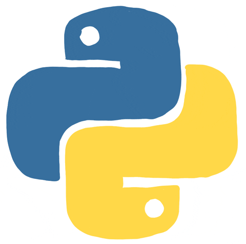
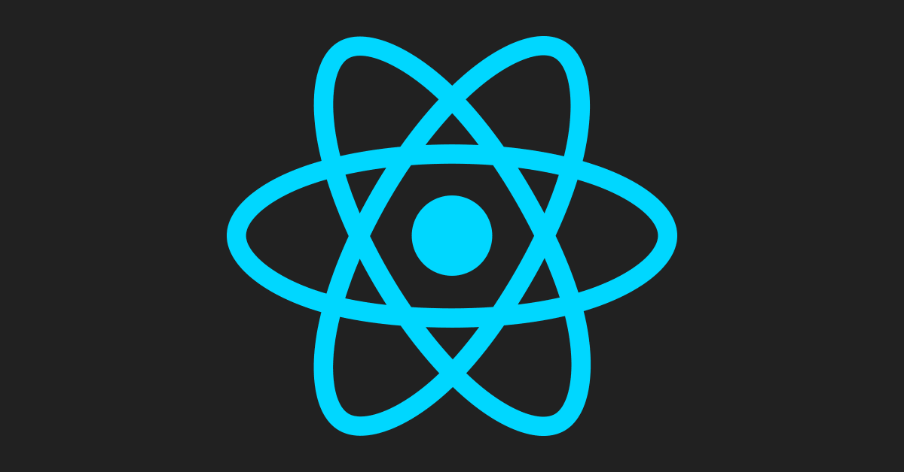
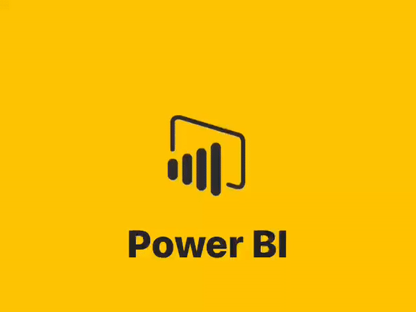
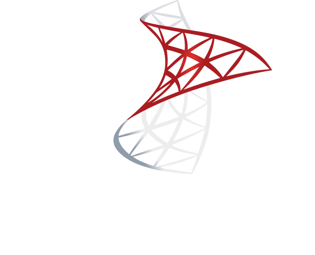

# ⚡ Tech Stack

### 🐍 Backend

  
  &nbsp;&nbsp;&nbsp;
  
  &nbsp;&nbsp;&nbsp;
  

  <b>Python · Django · Flask</b>

---

### 🌐 Frontend & 3D

  
  &nbsp;&nbsp;&nbsp;
  
  &nbsp;&nbsp;&nbsp;
  
  &nbsp;&nbsp;&nbsp;
  
  &nbsp;&nbsp;&nbsp;
  

  <b>HTML · CSS · JavaScript · React · Three.js</b>

---

### 📊 Data & Analytics

  
  &nbsp;&nbsp;&nbsp;
  

  <b>Pandas · ETL · Power BI</b>

---

### 🗄️ Databases

  
  &nbsp;&nbsp;&nbsp;
  
  &nbsp;&nbsp;&nbsp;
  

  <b>SQL Server · PostgreSQL · MySQL</b>

---

### ⚙️ Tools & Environment

  

  <b>Git · GitHub · Linux · VS Code · Azure</b>

